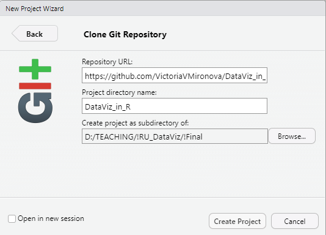

class: left, middle
####Preparatory step

##Data Vizualization in R
##Intro to GitHub
####Victoria Mironova 
####Associate Professor, Department of Plant Systems Physiology
---
#Why do you need GitHub in the course?
  
The source code for the lecture and tutorials is available via [GitHub](https://github.com/VictoriaVMironova/DataViz_in_R)

... so you can find how I built all the plots

... and reuse the code chunks

... you also can learn how to generate slides and/or reports using .Rmd

The data used in the course (raw and processed ones) can also be found there.

```{r library presentation, message=FALSE, include=FALSE} 
library(xaringanExtra)
library(xaringan)
use_xaringan_extra(c('panelset', 'editable', 'tile_view', 'scribble'))
```
---
#Basic Option: download the whole project in ZIP format

1) Go to https://github.com/VictoriaVMironova/DataViz_in_R

2) Choose Code/Download ZIP

```{r, out.width='40%', fig.align='center', echo= FALSE}

```

3) Unzip on your computer 

---
#Advanced option: use Git 

1) Install git and create a GitHub account 

2) Create a local git repository for [DataViz_in_R](https://github.com/VictoriaVMironova/DataViz_in_R):

.pull-left[
*New Project/Version control/Git/Clone Git Repository*
```{r, out.width='60%', fig.align='center', echo= FALSE}

```
]
.pull-right[
URL: https://github.com/VictoriaVMironova/DataViz_in_R
```{r, out.width='60%', fig.align='center', echo= FALSE}

```
]

3) run the code locally

4) you can [commit](https://github.com/git-guides/git-commit) the changes and [pull](https://docs.github.com/en/pull-requests/collaborating-with-pull-requests/proposing-changes-to-your-work-with-pull-requests/about-pull-requests) the requests to the `devel` [branch](https://docs.github.com/en/pull-requests/collaborating-with-pull-requests/proposing-changes-to-your-work-with-pull-requests/about-branches) if you would like to contribute to the course improvement

5) or you can [Fork](https://docs.github.com/en/get-started/quickstart/fork-a-repo) the repository to your GitHub account 
---
#First step working with the source files

0) Open the project in Rstudio

1) run *_packages.R* to install all the packages you need

2) run *Data_processing.R* to process the data

3) proceed with the course materials: 

  -  either open and knit *.Rmd* files, 
  
  -  or open *.html* files (choose *View in Web Browser* option).

---
#Tutorials on Git and GitHub

If you would like to learn more about version control using Git and GitHub, </br>
you can watch this tutorial on Youtube:

[0 experience to Professional in 1 Tutorial](https://www.youtube.com/watch?v=hrTQipWp6co)


or read this tutorial:

[An Intro to Git and GitHub for Beginners](https://product.hubspot.com/blog/git-and-github-tutorial-for-beginners)
