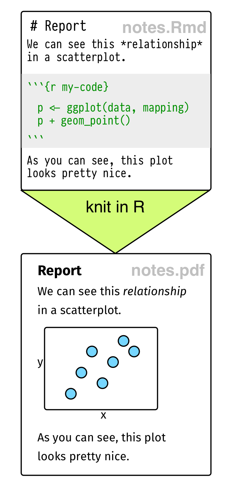
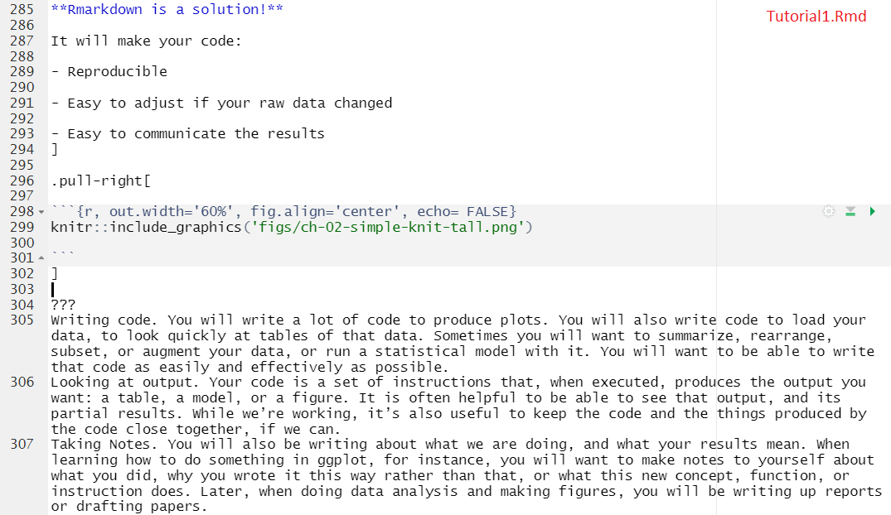

class: center, middle, inverse

#Intro to Rmarkdown


---
#Why Rmarkdown?

.pull-left[

While performing data visualization, you will find yourself constantly pinging back and forth between three things:


- Writing code. 

- Looking at output. 

- Taking Notes. 


**Rmarkdown is a solution!**

It will make your code:

- Reproducible

- Easy to adjust if your raw data changed

- Easy to communicate the results
]

.pull-right[

```{r, out.width='50%', fig.align='center', echo= FALSE}


```
]

???
Writing code. You will write a lot of code to produce plots. You will also write code to load your data, to look quickly at tables of that data. Sometimes you will want to summarize, rearrange, subset, or augment your data, or run a statistical model with it. You will want to be able to write that code as easily and effectively as possible.
Looking at output. Your code is a set of instructions that, when executed, produces the output you want: a table, a model, or a figure. It is often helpful to be able to see that output, and its partial results. While we’re working, it’s also useful to keep the code and the things produced by the code close together, if we can.
Taking Notes. You will also be writing about what we are doing, and what your results mean. When learning how to do something in ggplot, for instance, you will want to make notes to yourself about what you did, why you wrote it this way rather than that, or what this new concept, function, or instruction does. Later, when doing data analysis and making figures, you will be writing up reports or drafting papers.
---
class: center

#Rmarkdown in .Rmd file

```{r, out.width='55%', fig.align='center', echo= FALSE}
knitr::include_graphics('figs/ch-02-rstudio-markdown.png')

```

[SocViz](https://socviz.co/gettingstarted.html)


???
RMarkdown is not required for R. An alternative is to use an R script, which just contains R commands only.You can create an r script via File > New File > R Script. R script files conventionally have the extension .r or .R. (RMarkdown files conventionally end in .Rmd.) A very brief project might just need a single .r file. But RMarkdown is very useful for documents, notes, or reports of any length, especially when you need to take notes. If you do use an .r file you can leave comments or notes to yourself by starting a line with the hash character, #. You can also add comments at the end of lines in this way, as for any particular line R will ignore whatever code or text that appears after a #.
---
#Why do you need Rmd in the course?

Lectures and tutorials were designed in Rmarkdown (using [xaringan](https://github.com/yihui/xaringan) package).

This is how the source code of slide 14 looks like:
```{r, out.width='70%', fig.align='center', echo= FALSE}


```

---

#Why do you need Rmd in the course?

- Lectures and tutorials were designed in Rmarkdown (using [xaringan](https://github.com/yihui/xaringan) package).

- The source code for lectures and tutorials is available via [GitHub](https://github.com/VictoriaVMironova/DataViz_RU)

    ... so you can learn how it works

- You will make your assignment in Rmarkdown and submit it as .Rmd and .html files.

