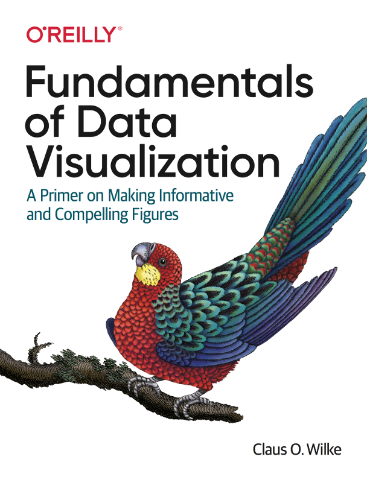
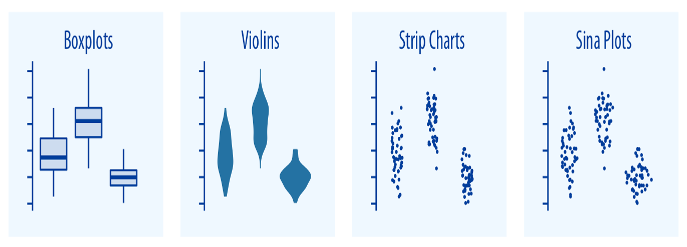

class: left, middle
####Lecture 1

##Data Vizualization in R
##Principles of figure design
####Victoria Mironova 
####Associate Professor, Department of Plant Systems Physiology


---
```{r include = FALSE}
knitr::opts_chunk$set(echo = FALSE, message = FALSE, warning = FALSE, fig.retina = 3)
set.seed(500)
```

.pull-left[

```{r, out.width='60%', fig.cap="source: unknown"}

```
]

--

.pull-right[

# Learning goals	

- Understand the basic principles behind effective data visualization. 	

- Create data visualizations in R using ggplot2 	

- Craft elegant visual presentations of data  

]

---
#Further reading

.pull-left[

```{r, out.width='70%', fig.align='center', fig.cap='https://clauswilke.com/dataviz/'}

```

]
.pull-right[


```{r, out.width='75%', fig.align='center', fig.cap='https://socviz.co/'}
knitr::include_graphics('figs/KieranHiely.jpg')
```
]

---
#Further studying

###Online tutorials:

 https://r-charts.com/

https://r-graph-gallery.com/

https://www.data-to-viz.com/

 https://cedricscherer.netlify.app/2019/08/05/a-ggplot2-tutorial-for-beautiful-plotting-in-r/

...


###3EC course in Radboud University:

NWI-BM083</br>
Data Visualization for the Life Sciences</br>
by K.W. Mulder

---
.pull-left[ 
```{r, out.width='60%', fig.cap="source: unknown"}
knitr::include_graphics('figs/DataStoryTelling2.jpg')
```
]
.pull-right[
#Course structure

**Week 5:**</br>
Lecture 1. Principles of figure design.</br>
Quiz 1.

**Week 6:**</br>
Tutorial 1. ggplot2: plots and charts.</br>
Quiz 2.

**Week 7:**</br>
Tutorial 2. ggplot2: statistics, coordinate system, facets. </br>
Tutorial 3. ggplot2: themes and styles.</br>
Practice 1. </br>
Quiz 3.

**Week 8:**</br>
Practice 2. Project.</br>
Practice 3. Project.</br>
Practice 4. Project.</br>
Assignment.

]

---
.pull-left[ 
```{r, out.width='60%', fig.cap="source: unknown"}
knitr::include_graphics('figs/DataStoryTelling2.jpg')
```
]
.pull-right[
#Evaluation criteria

**Week 5:**</br>
Lecture 1. Principles of figure design.</br>
*Quiz 1. --> passed*

**Week 6:**</br>
Tutorial 1. ggplot2: plots and charts.</br>
*Quiz 2. --> passed*

**Week 7:**</br>
Tutorial 2. ggplot2: statistics, coordinate system, facets. </br>
Tutorial 3. ggplot2: themes and styles.</br>
Practice 1. </br>
*Quiz 3. --> passed*


**Week 8:**</br>
Practice 2. Project.</br>

Practice 3. Project.</br>
Practice 4. Project.</br>
*Assignment. --> passed*
]
---

# This is a hands-on course

You will learn how to visualize the data in R.

These slides were also designed in R and you can find the source code on [GitHub](https://github.com/VictoriaVMironova/DataViz_RU):

```{r install packages, eval = FALSE} 
my_packages <- c("tidyverse", "ggplot2", "cowplot", "remotes")
install.packages(my_packages)

```

```{r library vizualization, warning = FALSE, echo = TRUE} 
library(tidyverse)
library(ggplot2)
library(cowplot)
library(viridis)
library(RColorBrewer)
```
---
class: left, middle, inverse

#Principles of figure design:

- Grammar of graphics

- Data

- Aesthetics

- Geometries

- Coordinates

- Color

---
#Grammar of graphics

.pull-left[
```{r, out.width='100%', fig.cap="Layers in grammar of graphics"}
knitr::include_graphics('figs/GrammarGraphics.png')
```
]
.pull-right[
The *grammar of graphics* is a plotting framework developed by Leland Wilkinson (Grammar of Graphics, 1999) that dissects each component of a graph into individual layer. 

There are two important principles:

- Graphics are made of distinct layers of grammatical elements

- Plots are built with appropriate aesthetic mappings to make these plots meaningful

]


---
#Grammar of graphics

.pull-left[
```{r, out.width='100%', fig.cap="Layers in grammar of graphics"}

```
]
.pull-right[


Three out of 7 layers are essential for any plot:

**Data** This is the dataset being plotted containing the variables to be plotted on the graph.

**Aesthetics**	Aesthetics refers to the scales on which we map the data. Some common aesthetics to consider are axis, shape, size, and color.

**Geometries**	Geom refers to the actual visual elements used for the data in the plot, such as points, lines, and bars.

]
---
class: center, middle, inverse

# Data

---
# CBS open data: the source 


https://opendata.cbs.nl/statline/
---
# Data 

Number of deaths in the population of the Netherlands by main underlying cause of death, by age and sex, 1996-2021

https://opendata.cbs.nl/statline/portal.html?_la=en&_catalog=CBS&tableId=7233ENG&_theme=1120


Identifier:	7233ENG

Short title:	deaths; cause of death (extensive list)

Reference period:	1996-2021
---
# Types of data

```{r, fig.height= 8, fig.width = 10, fig.align='center', echo = FALSE}
knitr::include_graphics('figs/DataType.png')
```


???
Lets consider the types of data we may want to represent in our visualization. You may think of data as numbers, but numerical discreet values are only one out of several types of data we may encounter. Roughly we can split the data into quantitative and qualitative. And the quantitative data can be of two types, as continuous and as discreet.
Qualitative data can be often found in scientific data, and it is also of two types: ordered and unordered.

Time & Date can be considered as a specific data type, because it has its own format that might contain quantitative data (like dates, years) and ordered qualitative data (like months).

---
#Types of data: example

.left-column[

```{r, fig.align='center'}
knitr::include_graphics('figs/DataType.png')
```
--

Which type of data is present in different columns?

]
.right-column[

```{r death table formatted, warning=FALSE} 

Death_in_NL <- read_delim(file = "Data/Death_in_NL_formatted.csv", col_names = TRUE, delim = ",")
Death_in_NL$CausesOfDeath <- as.factor(Death_in_NL$CausesOfDeath)
knitr::kable(slice_sample(Death_in_NL, n = 10), format = 'html')

```

]

???
To examine a concrete example of these various types of data, lets take a look at the Table on the right. It shows 10 randomly chosen rows from a dataset providing the statistics on the number of deaths in NL population. We will work with this data during this course so I will introduce it to you in greater detail on the next slides.
Can you already guess what types of data present in the columns?
---
# The data must be tidy to be plotted in gramar or graphics

Following three rules makes a dataset tidy:

- variables are in columns, 
- observations are in rows, 
- and values are in cells.

```{r, fig.align='center', echo = FALSE, fig.cap="source: R for Data Science 12.1"}
knitr::include_graphics('figs/tidy-1.png')
```
---
#Is this dataset tidy?

```{r tidy, ref.label = 'death table formatted', warning=FALSE} 
```

If you have doubts, check it in [R for data science](https://r4ds.had.co.nz/tidy-data.html#fig:tidy-structure) or in [TowardsDataScience](https://towardsdatascience.com/what-is-tidy-data-d58bb9ad2458)
---
class: center, middle, inverse

# Aesthetics
---

# Channels for representing data

Aesthetics describe every aspect of a given graphical element.

```{r common-aesthetics, fig.width = 12, fig.asp = 0.45}
#adjusted figure 2.1 from Claus Wilke's book 
aes_pos <- ggdraw() + 
  geom_segment(data = data.frame(x = c(0, 0.5),
                                 xend = c(1, 0.5),
                                 y = c(0.5, 0),
                                 yend = c(0.5, 1)),
                aes(x = x, y = y, xend = xend, yend = yend),
                arrow = arrow(length = grid::unit(12, "pt")), linewidth = .75) +
  draw_text("y", .5, 1, size = 12, vjust = 1, hjust = 2.5, colour = "black") +
  draw_text("x", 1, .5, size = 12, vjust = 2, hjust = 1, colour = "black") + 
  coord_cartesian(xlim = c(-.2, 1.2), ylim = c(-.2, 1.2))
aes_color <- ggdraw() +
  geom_tile(data = data.frame(x = 0.15 + .2333*(0:3)),
            aes(x, y = .5, fill = factor(x)), width = .2, height = .6)
aes_shape <- ggdraw() +
  geom_point(data = data.frame(x = (.5 + 0:3)/4),
             aes(x, y = .5, shape = factor(x)), size = 8, fill = "grey80") +
  scale_shape_manual(values = 21:24)
aes_size <- ggdraw() +
  geom_point(data = data.frame(x = (.5 + 0:3)/4),
             aes(x, y = .5, size = factor(x)), shape = 21, fill = "grey80") +
  scale_size_manual(values = c(2, 5, 8, 11))
aes_lwd <- ggdraw() +
  geom_segment(data = data.frame(x = rep(0.05, 4),
                                 xend = rep(0.95, 4),
                                 y = (1.5 + 0:3)/6,
                                 yend = (1.5 + 0:3)/6,
                                 size = 4:1),
               aes(x = x, y = y, xend = xend, yend = yend, linewidth = size)) +
  scale_size_identity()
aes_ltp <- ggdraw() +
  geom_segment(data = data.frame(x = rep(0.05, 4),
                                 xend = rep(0.95, 4),
                                 y = (1.5 + 0:3)/6,
                                 yend = (1.5 + 0:3)/6,
                                 linetype = 4:1),
               aes(x = x, y = y, xend = xend, yend = yend, linetype = linetype), linewidth = 1) +
  scale_linetype_identity()
plot_grid(aes_pos, aes_shape, aes_size,
          aes_color, aes_lwd, aes_ltp,
          ncol = 3,
          labels = c("position", "shape", "size", "color", "line width", "line type"), 
          label_size = 18,
          label_x = 0.05, label_y = 0.95, hjust = 0, vjust = 1)
```

--
</br> This figure has been created using ggplot2, adjusted from: https://clauswilke.com/dataviz/
--

---
#Scales map the data values onto aesthetics

.pull-left[
To map data values onto aesthetics, we need to specify which data values correspond to which specific aesthetics values.
``` {r scales map data1, fig.width = 5, fig.asp = 0.45, fig.align = "center"}
empty <- ggdraw()+
  draw_text("and", .5, .5, size = 16, vjust = 1, hjust = 1) 
plot_grid(aes_pos, empty, aes_color,
          ncol = 3,
          labels = c("position", "", "color"), 
          label_size = 16,
          label_x = 0.05, label_y = 0.95, hjust = 0, vjust = 1)
```

Position: 
  x = Year;
  y = Deaths;
Color = CausesOfDeath.
]

.pull-right[
```{r death table choice1, warning=FALSE} 
knitr::kable(head(Death_in_NL), format = 'html')

```
]

---

#Scaling data into 'position' and 'color' aestetics

.pull-left[
To map data values onto aesthetics, we need to specify which data values correspond to which specific aesthetics values.
``` {r scales map data0, fig.width = 5, fig.asp = 0.45, fig.align = "center"}
empty <- ggdraw()+
  draw_text("and", .5, .5, size = 16, vjust = 1, hjust = 1) 
plot_grid(aes_pos, empty, aes_color,
          ncol = 3,
          labels = c("position", "", "color"), 
          label_size = 16,
          label_x = 0.05, label_y = 0.95, hjust = 0, vjust = 1)
```
Position: 
  x = Year;
  y = Deaths;</br>
Color = CausesOfDeath.
]

.pull-right[
``` {r scales example, fig.width = 8, fig.asp = 0.6, fig.align = "center", warning = FALSE}
nb.cols <- 18
mycolors <- colorRampPalette(brewer.pal(8, "Set1"))(nb.cols)

Death_in_NL %>%
  filter(Age == "Total", Sex == "Male")%>%
  ggplot()+
  geom_path(mapping = aes(x = Year, y = Deaths, color = CausesOfDeath), linewidth = 1)+
  scale_colour_manual(values = mycolors)+
  ggtitle("Total number of deaths from different causes")+
  theme_classic()+
  labs(x = NULL, y = NULL)+
  theme(legend.title = element_blank(),
        axis.text = element_text(size = 12),
        legend.text = element_text(size = 12))
```
]
---
#Scaling data into 'position' and 'line type' aestetics
.pull-left[
``` {r scales map data3, fig.width = 5, fig.asp = 0.45, fig.align = "center"}
 
plot_grid(aes_pos, empty, aes_ltp,
          ncol = 3,
          labels = c("position", "", "line type"), 
          label_size = 16,
          label_x = 0.05, label_y = 0.95, hjust = 0, vjust = 1)
```
Position: x = Year; y = Deaths; </br>
Line type = Sex.
]

.pull-right[
``` {r scales example2, fig.width = 8, fig.asp = 0.6, fig.align = "center", warning = FALSE}
Death_in_NL %>%
  filter(Age == "Total", CausesOfDeath == "Infections")%>%
  ggplot(mapping = aes(x = Year, y = Deaths, linetype = Sex))+
  geom_path()+
  ggtitle("Number of deaths from infections")+
  theme_classic()+
  labs(x = NULL, y = NULL)+
  theme(legend.title = element_blank(),
        axis.text = element_text(size = 12),
        legend.text = element_text(size = 12))
```
]
---
#Scaling data into 'position', 'line type'&'shape'
.pull-left[
``` {r scales map data4, fig.width = 6, fig.asp = 0.45, fig.align = "center"}
 
plot_grid(aes_pos, aes_ltp, aes_shape,
          ncol = 3,
          labels = c("position", "line type", "point shape"), 
          label_size = 16,
          label_x = 0.05, label_y = 0.95, hjust = 0, vjust = 1)
```
Position: x = Year; y = Deaths;</br> 
Point Shape & Line Type = Sex.
]

.pull-right[
``` {r scales example3, fig.width = 8, fig.asp = 0.6, fig.align = "center", warning = FALSE}
Death_in_NL %>%
  filter(Age == "Total", CausesOfDeath == "Infections")%>%
  ggplot(mapping = aes(x = Year, y = Deaths))+
  geom_path(mapping = aes(linetype = Sex))+
  geom_point(mapping = aes(shape = Sex), size = 2.5)+
  ggtitle("Number of deaths from infections")+
  theme_classic()+
  labs(x = NULL, y = NULL)+
  theme(legend.title = element_blank(),
        axis.text = element_text(size = 12),
        legend.text = element_text(size = 12))
```
]
---
#Scaling continuous quantitative data into color

.pull-left[
``` {r data table for heatmap}
knitr::kable(head(Death_in_NL), format = 'html')

```
Color: Deaths;</br> 
Position x: Year</br>
Position y: Age
]

.pull-right[
``` {r heatmap example, fig.width = 8, fig.asp = 0.8, fig.align = "center"}
Death_in_NL %>% 
  filter(Sex == "Male", CausesOfDeath == "Infections", Age != "Total") %>% 
  ggplot(mapping = aes(x = Year, y = Age, fill = Deaths))+
  geom_tile()+
  scale_fill_viridis(discrete = FALSE)+
  ggtitle("Number of deaths from infections depending on age, men")+
  theme_classic()+
  labs(x = NULL, y = NULL)+
  theme(legend.title = element_blank(),
        axis.text = element_text(size = 12),
        legend.text = element_text(size = 12),
        axis.line = element_blank())
```
]
---
class: center, middle, inverse

# Geometries


---
#Geometries

Geoms can be roughly divided into individual and collective geoms. An individual geom draws a distinct graphical object for each observation (row). Here are the examples

``` {r geom, fig.width = 8, fig.asp = 0.8, fig.align = "center"}
df <- data.frame(
  x = c(3, 2, 4, 6), 
  y = c(1, 3, 4, 5), 
  label = c("a","b","c", "d")
)
p <- ggplot(df, aes(x, y, label = label)) + 
  labs(x = NULL, y = NULL) + # Hide axis label
  theme(plot.title = element_text(size = 12))

p_point <- p + geom_point()+ ggtitle("point")
p_text <-p + geom_text() + ggtitle("text")
p_bar <- p + geom_bar(stat = "identity") + ggtitle("bar")
p_line <- p + geom_line() + ggtitle("line")
p_area <- p + geom_area() + ggtitle("area")
p_path <- p + geom_path() + ggtitle("path")


plot_grid(p_point, p_line, p_bar,
          p_area, p_path, p_text,
          ncol = 3,
          label_size = 12,
          label_x = 0.05, label_y = 0.95, hjust = 0, vjust = 1)
```
---

#Geometries

A collective geom displays multiple observations with one geometric object. This may be a result of a statistical summary, like a boxplot, density plot, or histogram.

``` {r collective geom, fig.width = 12, fig.asp = 0.4, fig.align = "center", message = FALSE}
smoothp <- Death_in_NL %>% 
  filter(CausesOfDeath == "Infections", Age == "Total") %>% 
  ggplot(mapping = aes(x = Year, y = Deaths, color = Sex))+
  geom_smooth()+
  ggtitle("Smoothed conditional means")

boxp <- Death_in_NL %>% 
  filter(Age == "Total") %>% 
  ggplot(mapping = aes(x = Sex, y = Deaths, fill = Sex))+
  geom_boxplot()+
  ggtitle("Boxplot")
  
denp <- Death_in_NL %>% 
  filter(Age == "Total") %>% 
  ggplot(aes(x = Deaths, fill = Sex))+
  geom_density(alpha = 0.5)+
  ggtitle("Smoothed density estimate")

plot_grid(smoothp, denp, boxp,
          ncol = 3,
          label_size = 12,
          label_x = 0.05, label_y = 0.95, hjust = 0, vjust = 1)

```

---
class: center, middle

#How to choose the geom type?

</br>
Source: [from Data to Viz](https://www.data-to-viz.com/).

---
#How to vizualize amounts?

The most common way to visualizing amounts is using bars, either vertically or horizontally arranged.
Instead of using bars, one can also place dots at the location where the corresponding bar would end.

</br>

--

If there are two or more sets of categories for which one wants to show amounts, one can group or stack the bars. One can also map the categories onto the x and y axis and show amounts by color, via a heatmap.

</br>

Source: [Fundamentals of Data Vizualization](https://clauswilke.com/dataviz).

---
#How to vizualize distributions?

Histograms and density plots provide the most intuitive visualizations of a distribution, but both require arbitrary parameter choices and can be misleading. 


--


--

Boxplots, violins, strip charts, and sina plots are useful when one wants to visualize many distributions at once and/or if we are primarily interested in overall shifts among the distributions.

</br>

Source: [Fundamentals of Data Vizualization](https://clauswilke.com/dataviz).
---
#How to vizualize proportions?

Proportions can be visualized as pie charts, side-by-side bars, or stacked bars. Pie charts emphasize that the individual parts add up to a whole and highlight simple fractions. However, the individual pieces are more easily compared in side-by-side bars.

</br>
--
When visualizing multiple sets of proportions, pie charts tend to be space-inefficient and often obscure relationships. Grouped bars work well as long as the number of conditions compared is moderate, and stacked bars can work for large numbers of conditions. Stacked densities are appropriate when the proportions change along a continuous variable.


Source: [Fundamentals of Data Vizualization](https://clauswilke.com/dataviz).
---
#How to vizualize x-y relationships

Scatterplots are typical representation of x-y relationships. If we have three quantitative variables, we can map one onto the dot size, creating a bubble chart. If the variables along the x and the y axes are measured in the same units, it is helpful to add a line indicating x = y. Paired data can also be shown as a slope graph of paired points connected by straight lines.

</br>
--
When the x axis represents time or a gradually increasing quantity, we commonly draw line graphs. If we have a temporal sequence of two response variables, we can draw a connected scatterplot. We can use smooth lines to represent trends in a larger dataset.


Source: [Fundamentals of Data Vizualization](https://clauswilke.com/dataviz).
---
#There are more vizualization types...

...which we won't be able to overview in this small course.</br>
But you can learn more on them in Claus Wilke's book on [Fundamentals of Data Vizualization](https://clauswilke.com/dataviz).

</br>
</br>


---

class: center, middle, inverse

#Color

---
#Color
.pull-left[
There are four fundamental use cases for color in data visualizations: 
- to distinguish groups of data from each other; 
- to highlight relevant information;
- to represent data values;
- to adjust the layout (data-unrelated color).
]
.pull-right[
]
---
#Color: case 1
.pull-left[
There are four fundamental use cases for color in data visualizations: 
- <a style="color:red">to distinguish groups of data from each other</a>; 
- to highlight relevant information; 
- to represent data values;
- to adjust the layout (data-unrelated color).
]
.pull-right[
``` {r colored barplot, fig.width = 8, fig.asp = 0.8, fig.align = "center"}
Death_in_NL %>%
  filter(Age == "Total", Year == 2020)%>%
  ggplot(mapping = aes(x = reorder(CausesOfDeath, -Deaths), y = Deaths, fill = CausesOfDeath))+
  geom_col()+
  coord_flip()+
  scale_fill_manual(values = mycolors)+
  ggtitle("Causes of Death in NL in 2020")+
    theme_classic()+
  labs(x = NULL, y = NULL)+
  theme(legend.title = element_blank(),
        axis.text = element_text(size = 12),
        legend.text = element_text(size = 12))
```
]
---
#Color: case 1
.pull-left[
There are four fundamental use cases for color in data visualizations: 
- <a style="color:red">to distinguish groups of data from each other</a>; 
- to highlight relevant information; 
- to represent data values;
- to adjust the layout (data-unrelated color).
]
.pull-right[
``` {r line plot repeat, ref.label = "scales example", fig.width = 8}

```
]
---
#Color: case 2
.pull-left[
There are four fundamental use cases for color in data visualizations: 
- to distinguish groups of data from each other; 
- <a style="color:red">to highlight relevant information</a>; 
- to represent data values;
- to adjust the layout (data-unrelated color).
]
.pull-right[
``` {r colored barplot2, fig.width = 8, fig.asp = 0.8, fig.align = "center"}
Death_in_NL %>%
  filter(Age == "Total", Year == 2020)%>%
  mutate(highlight = ifelse(CausesOfDeath == "ExternalCauses", TRUE, FALSE))%>%
  ggplot()+
  geom_col(mapping = aes(x = reorder(CausesOfDeath, -Deaths), y = Deaths, fill = highlight), show.legend = FALSE)+
  coord_flip()+
  scale_fill_manual(values = c("grey", "red"))+
  ggtitle("Causes of Death in NL in 2020")+
  theme_classic()+
  labs(x = NULL, y = NULL)+
  theme(axis.text = element_text(size = 12))

```
]
---
#Color: case 3
.pull-left[
There are four fundamental use cases for color in data visualizations: 
- to distinguish groups of data from each other; 
- to highlight relevant information; 
- <a style="color:red">to represent data values</a>;
- to adjust the layout (data-unrelated color).
]
.pull-right[
```{r heatmap repeat, ref.label = "heatmap example"}

```
]
---
#Color: case 4
.pull-left[
There are four fundamental use cases for color in data visualizations: 
- to distinguish groups of data from each other; 
- to highlight relevant information; 
- to represent data values;
- <a style="color:red">to adjust the layout (data-unrelated color)</a>.
]
.pull-right[
``` {r colored barplot3, fig.width = 8, fig.asp = 0.8, fig.align = "center"}
Death_in_NL %>%
  filter(Age == "Total", Year == 2020)%>%
  mutate(highlight = ifelse(CausesOfDeath == "ExternalCauses", TRUE, FALSE))%>%
  ggplot()+
  geom_col(mapping = aes(x = reorder(CausesOfDeath, -Deaths), y = Deaths, fill = highlight), show.legend = FALSE)+
  coord_flip()+
  scale_fill_manual(values = c("grey", "red"))+
  ggtitle("Causes of Death in NL in 2020")+
  theme_dark()+
  labs(x = NULL, y = NULL)+
  theme(axis.text = element_text(size = 12))
```
]
---
#To do before next week

- Pass the quiz on the Brightspace.

- Explore the source code of the lecture via [GitHub](https://github.com/VictoriaVMironova/DataViz_RU)

- Be sure that you have the most recent version of R installed.

