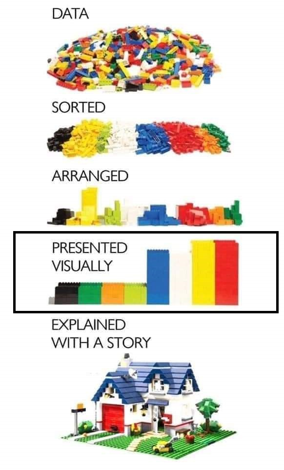

class: left, middle
####Tutorial 1

##Data Vizualization in R
##ggplot2: plots and charts
####Victoria Mironova 
####Associate Professor, Department of Plant Systems Physiology


---
```{r include = FALSE}
knitr::opts_chunk$set(message = FALSE, warning = FALSE, fig.retina = 3)
set.seed(100)
```

.pull-left[
#Course structure

**Week 1-2:**</br>
Lecture 1. Principles of figure design.</br>
Quiz 1.

**Week 3-4:**</br>
**Tutorial 1. ggplot2: plots and charts.**</br>
**Quiz 2.**

**Week 5-6:**</br>
Tutorial 2. ggplot2: statistics, coordinate system, facets. </br>
Tutorial 3. ggplot2: themes and styles.</br>
Practice 1. </br>
Quiz 3.

**Week 7-8:**</br>
Practice 2. Project.</br>
Practice 3. Project.</br>
Practice 4. Project.</br>
Assignment.
]

--
.pull-right[

# Learning goals	

- Understand the basic principles behind effective data visualization	

- **Create data visualizations in R using ggplot2**

- Craft elegant visual presentations of data

]
---
class: left, middle, inverse

#Plan of the tutorial

- ggplot2

- Preparatory steps:

  - Install libraries
  - Get data into R

- Design basic plots with ggplot2

  - Visualize amounts
  - ... x-y relationship
  - ... distributions

---

.pull-left[ 
```{r, out.width='60%', echo= FALSE, fig.cap="source: unknown", echo = FALSE}

```
]

.pull-right[

##Data vizualization platforms:

- ...

- Microsoft Excel and analogs

- MatplotLib, Seaborn, and Plotly in Python

- **ggplot2 in R**


]

???
There are many platform for data vizualization. For sure, you are aware of at least one of them, Microsoft Excel or its analogs. However, there are many powerful data vizualization tools that allow scientists to communicate their findings more effectively. Like MatPlotLib and Seaborn Python libraries. This course is about one of such powerful systems made for R programming scientific community. It is ggplot2.

---
#ggplot2 applies the grammar of graphics

.pull-left[
```{r, out.width='100%', fig.cap="Layers in grammar of graphics",  echo = FALSE}
knitr::include_graphics('figs/GrammarGraphics.png')
```
]
.pull-right[
The *grammar of graphics* is a plotting framework developed by Leland Wilkinson (Grammar of Graphics, 1999) that dissects each component of a graph into individual layer. 

There are two important principles:

- Graphics are made of distinct layers of grammatical elements

- Plots are built with appropriate aesthetic mappings to make these plots meaningful

]


---
#Grammar of graphics

.pull-left[
```{r, out.width='100%', fig.cap="Layers in grammar of graphics",  echo = FALSE}
knitr::include_graphics('figs/GrammarGraphics2.png')
```
]
.pull-right[


Three out of 7 layers are essential for any plot:

**Data** This is the dataset being plotted containing the variables to be plotted on the graph.

**Aesthetics**	Aesthetics refers to the scales on which we map the data. Some common aesthetics to consider are axis, shape, size, and color.

**Geometries**	Geom refers to the actual visual elements used for the data in the plot, such as points, lines, and bars.

]
---
#ggplot2: a simplified graphing template
To make a graph, replace the bracketed sections in the following code with a *dataset*, a *geom* function, and a collection of *mappings*.

`ggplot(data = <DATA>)+` </br>
`  <GEOM_FUNCTION>(mapping = aes(<MAPPINGs>))`

---
class: middle, inverse

# Preparatory steps:

- Install libraries

- Get data into R

---
# Installing the packages

Installation of the packages in R studio:

```{r install packages, eval= FALSE} 
my_packages <- c("tidyverse", "ggplot2") #<<
install.packages(my_packages) #<<

```

Call the libraries to your file:

```{r library vizualization, warning=FALSE, message = FALSE} 
library(tidyverse) #<<
library(ggplot2) #<<
```


```{r library presentation, message=FALSE, include=FALSE} 
library(xaringanExtra)
library(xaringan)
use_xaringan_extra(c('panelset', 'editable', 'tile_view', 'scribble'))
```

???
You might require additional packages to be installed...

---
#Getting data into R

Number of deaths in the population of the Netherlands by main underlying cause of death, by age and sex, 1996-2021

https://opendata.cbs.nl/statline/portal.html?_la=en&_catalog=CBS&tableId=7233ENG&_theme=1120


Identifier:	7233ENG

Short title:	deaths; cause of death (extensive list)

Reference period:	1996-2022


---
#Getting data into R
.panelset[
.panel[.panel-name[Code]
```{r loading death data} 
Death_in_NL <- read_csv2(file = "Data/7233ENG_TypedDataSet_04112022_143444.csv") #<<

```
]

.panel[.panel-name[Table]

```{r looking at othe data} 

knitr::kable(head(Death_in_NL), format = 'html')

```
]
]
???
Cleaning and reading in your data is one of the least immediately satisfying pieces of an analysis. Fortunately, many of you already know how to manage data in R if you are taking Mandy Velthuis course on the data management in R. In this small course we will use preprocessed data. 

But we still need to load the data into R, so we'll discuss this step.

The code you see on the slide load the data downloaded from CBS Open data using read_csv() function from tidyverse package.


The resulting message gives some information about the loaded file. Like the size. It also names the columns and tells us that the read_csv() function has assigned a class to each of the columns of the object it created from the CSV file. 


You can look at the loaded table via "Environment" tab

How do you think, is it a clean data? Can we work further with it?
One can find the meaning for all these identification in 7233ENG_metadata.csv file from CBS

---
#Formating the data

.panelset[
.panel[.panel-name[Code]
```{r death table format 1} 
Death_in_NL <- Death_in_NL %>%
  mutate(Sex = recode(Sex, "3000" = "Male", "4000" = "Female")) %>%
  mutate(CausesOfDeath = recode(CausesOfDeath,
                      "A010668" = "Infections", "A010840" = "Neoplasms", "A011013" = "Endocr+Metabol", "A011087" = "Psychological", 
                      "A011166" = "NervousSystem", "A011234" = "Eye+Adnexa","A011307" = "CirculatorySystem", "A011384" = "RespiratorySystem",
                      "A011449" = "DigestiveSystem", "A011521" = "SkinDeseases", "A011594" = "MusculSystem", "A011674" = "GenitourinarySystem",
                      "A011757" = "Pregnancy+Childbirth", "A011833" = "Perinatal", "A011893" = "CongenitalMalform", "A011981" = "UnclassifiedAbnorm",
                      "A050205" = "COVID-19", "A012072" = "ExternalCauses")) %>%
  mutate(Age = recode(Age,
                      "10000" = "Total", "10010" = "0", "22000" = "95+", "51300" = "1-9", "70200" = "1-9", "70300" = "10-14", "70400" = "15-19", "70500" = "20-24",
                      "70600" = "25-29", "70700" = "30-34", "70800" = "35-39", "70900" = "40-44", "71000" = "45-49", "71100" = "50-54", "71200" = "55-59", "71300" = "60-64",
                      "71400" = "65-69", "71500" = "70-74", "71600" = "75-79", "71700" = "80-84", "71800" = "85-89", "71900" = "90-94")) %>%
  mutate(Periods = recode(Periods,
                      "1996JJ00" = "1996", "1997JJ00" = "1997", "1998JJ00" = "1998", "1999JJ00" = "1999", "2000JJ00" = "2000", "2001JJ00" = "2001", "2002JJ00" = "2002", "2003JJ00" = "2003",
                      "2004JJ00" = "2004", "2005JJ00" = "2005", "2006JJ00" = "2006", "2007JJ00" = "2007", "2008JJ00" = "2008", "2009JJ00" = "2009", "2010JJ00" = "2010", "2011JJ00" = "2011",
                      "2012JJ00" = "2012", "2013JJ00" = "2013", "2014JJ00" = "2014", "2015JJ00" = "2015", "2016JJ00" = "2016",  "2017JJ00" = "2017", "2018JJ00" = "2018",  "2019JJ00" = "2019",
                      "2020JJ00" = "2020",  "2021JJ00" = "2021")) %>%
  rename("Year" = "Periods", "Deaths" = "Deaths_1")%>%
  drop_na(Deaths)%>%
  mutate(Year = as.numeric(Year))
```
]
.panel[.panel-name[Output]
```{r death table formatted, warning=FALSE, echo = FALSE} 
knitr::kable(slice_sample(Death_in_NL, n = 10), format = 'html')
```
]
]
???
Since the goal of this course is not to teach you all about R, but just how to produce good graphics, we can ignore many details, before they start interfering with you vizualizations of course. 

But we need to polish the data, so it is more easily readable on the plots
---
#Data types: 

```{r death table values, warning=FALSE, echo = FALSE} 
knitr::kable(slice_sample(Death_in_NL, n = 5), format = 'html')
```

- **ID**: Numeric ordered;
- **Sex**: Factor, unordered;
- **Age**: Factor, unordered;
- **CausesOfDeath**: Factor, unordered;
- **Year**: Numeric, ordered;
- **Deaths**: Numeric, unordered.

---
#Build your first plot

.panelset[
.panel[.panel-name[Code]

Graphing template: 

`ggplot(data = <DATA>)+` </br>
`  <GEOM_FUNCTION>(mapping = aes(<MAPPINGs>))`

Applied to the data:  
```{r causes death first plot, eval = FALSE, fig.width = 14, fig.height = 6} 
Total <- filter(Death_in_NL, Age == "Total")
ggplot(data = Total)+
  geom_point(mapping = aes(x = CausesOfDeath, y = Deaths))

```

]
.panel[.panel-name[Output]
```{r causes death first plot, eval = TRUE, warning=FALSE, echo = FALSE, fig.width = 14, fig.height = 6} 
```
]
]

???
What you can understand from this plot?
What are the problems?
---
#Build your second plot

.panelset[
.panel[.panel-name[Code]
Graphing template: 

`ggplot(data = <DATA>)+` </br>
`  <GEOM_FUNCTION>(mapping = aes(<MAPPINGs>))`

Applied to the data:  
```{r death plot 2, eval = FALSE, fig.width = 14, fig.height = 6} 
Total <- filter(Death_in_NL, Age == "Total")
ggplot(data = Total)+
  geom_point(mapping = aes(x = Year, y = Deaths)) #<<

```
]
.panel[.panel-name[Output]
```{r death plot 2, eval = TRUE, echo = FALSE, fig.width = 14, fig.height = 6} 
```
]
]
---
#Build your second plot: edited version

.panelset[
.panel[.panel-name[Code]
```{r death plot 3, eval = FALSE, warning=FALSE, fig.width = 14, fig.height = 6} 
Total_men <- filter(Death_in_NL, Age == "Total", Sex == "Male")
ggplot(data = Total_men)+
  geom_point(mapping = aes(x = Year, y = Deaths, color = CausesOfDeath))
```
]
.panel[.panel-name[Output]
```{r death plot 3, eval = TRUE, echo = FALSE, fig.width = 14, fig.height = 6} 
```
]
]
---
#Build your second plot: edited version 2

.panelset[
.panel[.panel-name[Code]
```{r death plot edit, eval = FALSE} 
Total_men <- filter(Death_in_NL, Age == "Total", Sex == "Male")
ggplot(data = Total_men)+
  geom_point(mapping = aes(x = Year, y = Deaths, color = CausesOfDeath))+
  geom_path(mapping = aes(x = Year, y = Deaths, color = CausesOfDeath))#<<
```

]
.panel[.panel-name[Output]
```{r death plot edit, eval = TRUE, warning=FALSE, echo = FALSE, fig.width = 14, fig.height = 6} 
```
]
]
---
#Polishing the code

.panelset[
.panel[.panel-name[Code]
These three chunks of code generate the same plot:
```{r death plot edit1, eval = FALSE} 
Total_men <- filter(Death_in_NL, Age == "Total", Sex == "Male")
ggplot(data = Total_men)+
  geom_point(mapping = aes(x = Year, y = Deaths, color = CausesOfDeath))+
  geom_path(mapping = aes(x = Year, y = Deaths, color = CausesOfDeath))
```

```{r death plot edit2, eval = FALSE} 
Total_men <- filter(Death_in_NL, Age == "Total", Sex == "Male")
ggplot(Total_men, aes(x = Year, y = Deaths, color = CausesOfDeath))+
  geom_point()+
  geom_path()
```

```{r death plot edit3, eval = FALSE} 
Death_in_NL %>%
  filter(Age == "Total", Sex == "Male") %>%
  ggplot(aes(x = Year, y = Deaths, color = CausesOfDeath))+
  geom_point()+
  geom_path()
```

]
.panel[.panel-name[Output]
```{r death plot edit3, eval = TRUE, echo = FALSE, fig.width = 14, fig.height = 5}
```
]
]
---
#Graphing template: updated

.pull-left[
Minimal template:</br>
`ggplot(data = <DATA>)+` </br>
`  <GEOM_FUNCTION>(mapping = aes(<MAPPINGs>))</br>`
]
.pull-right[
Updated template:</br>
`ggplot(<DATA>)+` </br>
`  <GEOM_FUNCTION1>(aes(<MAPPINGs1>))+`</br>
`  <GEOM_FUNCTION2>(aes(<MAPPINGs2>))+`</br>
`  <GEOM_FUNCTION3>(aes(<MAPPINGs3>))`</br>

or if geoms use the same mappings:</br>
`ggplot(<DATA>, aes(<MAPPINGs>)+` </br>
`  <GEOM_FUNCTION1>()+`</br>
`  <GEOM_FUNCTION2>()+`</br>
`  <GEOM_FUNCTION3>()`</br>

or you can pipe (%>%) the data into ggplot:</br>
`DATA %>%`</br>
`ggplot()+` </br>
`  <GEOM_FUNCTION1>(aes(<MAPPINGs1>))+`</br>
`  <GEOM_FUNCTION2>(aes(<MAPPINGs2>))+`</br>
`  <GEOM_FUNCTION3>(aes(<MAPPINGs3>))`
]
---
class:  middle, inverse

# Build different vizualizations

##Visualizing amounts

---
# Vizualizing amounts: bar plot 

In many scenarios, we are interested in the magnitude of some set of numbers. The standard visualization in this scenario is the bar plot, which comes in several variations, including simple bars as well as grouped and stacked bars. 

.panelset[
.panel[.panel-name[Code]

```{r bar plot, eval=FALSE}
Neoplasms <- filter(Death_in_NL, CausesOfDeath == "Neoplasms",
                    Year == "2020",  Sex = "Male", Age != "Total")
ggplot(data = Neoplasms)+
   geom_col(mapping = aes(x = Age, y = Deaths))
```

or we can write the same concise:
```{r bar plot2, eval=FALSE, fig.width = 12, fig.height = 5} 
Death_in_NL %>%
  filter(CausesOfDeath == "Neoplasms", 
         Year == "2020", Sex == "Male", Age != "Total")%>%
  ggplot(aes(x = Age, y = Deaths))+
    geom_col()
```
]
.panel[.panel-name[Output]
```{r bar plot2, warning=FALSE, echo = FALSE, eval = TRUE,  fig.width = 12, fig.height = 5} 
```
]
]
---
# Vizualizing amounts: grouped bar plot 

In a grouped bar plot, we draw a group of bars at each position along the x axis, determined by one categorical variable, and then we draw bars within each group according to the other categorical variable.

.panelset[
.panel[.panel-name[Code]

```{r grouped bar plot, eval=FALSE} 
Death_in_NL %>%
  filter(CausesOfDeath == "Neoplasms", 
         Year == "2020", Age != "Total")%>%
  ggplot(aes(x = Age, y = Deaths, fill = Sex))+
    geom_col(position = "dodge")
```
]
.panel[.panel-name[Output]
```{r grouped bar plot, eval = TRUE, warning=FALSE, echo = FALSE, eval = TRUE,  fig.width = 12, fig.height = 5} 
```
]
]
---
# Vizualizing amounts: stacked bar plot 
Instead of drawing groups of bars side-by-side, it is sometimes preferable to stack bars on top of each other. Stacking is useful when the sum of the amounts represented by the individual stacked bars is in itself a meaningful amount.

.panelset[
.panel[.panel-name[Code]
```{r stacked bar plot, eval=FALSE} 
Death_in_NL %>%
  filter(CausesOfDeath == "Neoplasms", 
         Year == "2020", Age != "Total")%>%
  ggplot(aes(x = Age, y = Deaths, fill = Sex))+
    geom_col(position = "stack")
```
]
.panel[.panel-name[Output]
```{r stacked bar plot, eval = TRUE, warning=FALSE, echo = FALSE, eval = TRUE,  fig.width = 12, fig.height = 5} 
```
]
]
---
#Vizualizing amounts: heatmap

As an alternative to mapping data values onto positions via bars or dots, we can map data values onto colors. Such a figure is called a heatmap.

.panelset[
.panel[.panel-name[Code]

``` {r heatmap example, eval = FALSE}
Death_in_NL %>% 
  filter(Sex == "Male", CausesOfDeath == "Infections", Age != "Total") %>% 
  ggplot(mapping = aes(x = Year, y = Age, fill = Deaths))+
  geom_tile()
```
]
.panel[.panel-name[Output]
```{r heatmap example, eval = TRUE, warning=FALSE, echo = FALSE, eval = TRUE,  fig.width = 8, fig.height = 5} 
```
]
]
---
class:  middle, inverse

# Build different vizualizations

##Visualizing x-y relationships

---
#Scatterplot
A Scatterplot displays the relationship between two numeric variables. 

.panelset[
.panel[.panel-name[Code]

```{r scatterplot, eval=FALSE}
Neoplasms <- filter(Death_in_NL, CausesOfDeath == "Neoplasms", Age == "Total")
p <- ggplot(data = Neoplasms)+
    geom_point(mapping = aes(x = Year, y = Deaths, color = Sex)) #<<
```

or we can write the same more concise:
```{r scatterplot1, eval=FALSE, fig.width = 12, fig.height = 6} 
Death_in_NL %>%
  filter(CausesOfDeath == "Neoplasms", Age == "Total")%>%
  ggplot(aes(x = Year, y = Deaths, color = Sex))+
    geom_point()
```
]
.panel[.panel-name[Output]
```{r scatterplot1, warning=FALSE, echo = FALSE, eval = TRUE,  fig.width = 12, fig.height = 6} 
```
]
]
---
#Line chart
A line chart or line graph displays the evolution of one or several numeric variables. The input data frame requires at least two columns: an ordered numeric variable for the X axis; (2) another numeric variable for the Y axis.

.panelset[
.panel[.panel-name[Code]
```{r line chart, eval = FALSE, warning=FALSE, fig.width = 12, fig.height = 5} 
Death_in_NL %>%
  filter(CausesOfDeath == "Neoplasms", Age == "Total")%>%
  ggplot(aes(x = Year, y = Deaths, color = Sex))+
    geom_line() #<<


```
]
.panel[.panel-name[Output]
```{r line chart, eval = TRUE, warning=FALSE, echo = FALSE, fig.width = 12, fig.height = 5} 
```
]
]
---
#Line chart: updated

.panelset[
.panel[.panel-name[Code]
```{r line chart and scatter, eval = FALSE} 
Death_in_NL %>%
  filter(CausesOfDeath == "Neoplasms", Age == "Total")%>%
  ggplot(aes(x = Year, y = Deaths, color = Sex))+
    geom_line()+
    geom_point(shape=21, size=2)
```
]
.panel[.panel-name[Output]
```{r line chart and scatter, eval = TRUE, warning=FALSE, echo = FALSE, fig.width = 12, fig.height = 6} 
```
]
]
---
#Smooth line graph 
We can use smooth lines to represent trends in a larger dataset. The act of smoothing produces a function that captures key patterns in the data while removing irrelevant minor detail or noise.

.panelset[
.panel[.panel-name[Code]
``` {r smooth plot, eval = FALSE}
Death_in_NL %>% 
  filter(CausesOfDeath == "Infections", Age == "Total") %>% 
  ggplot(mapping = aes(x = Year, y = Deaths, color = Sex))+
  geom_smooth()+
  ggtitle("Smoothed conditional means")
```
]
.panel[.panel-name[Output]
```{r smooth plot, eval = TRUE, warning=FALSE, echo = FALSE, fig.width = 12, fig.height = 6} 
```
]
]
---
class:  middle, inverse

# Build different vizualizations

##Visualizing distributions
---
# Histogram

A histogram takes as input a *numeric* variable only. The variable is cut into several *bins*, and the number of observation per *bin* is represented by the height of the bar.

.panelset[
.panel[.panel-name[Code]
```{r hist, eval = FALSE} 
Death_in_NL %>%
  filter(Age == "Total")%>%
  ggplot(aes(x = Deaths))+
  geom_histogram(binwidth=500) #<<

```

]
.panel[.panel-name[Output]
```{r hist, eval = TRUE, warning=FALSE, echo = FALSE, fig.width = 14, fig.height = 5.5} 
```
]
]

---
#Histogram: binwidth

Play with the *bin* size, it can give different insight.


.panelset[
.panel[.panel-name[Code]
```{r hist bin, eval = FALSE, out.width='50%', fig.align='center'} 
Death_in_NL %>%
  filter(Age == "Total")%>%
  ggplot(aes(x = Deaths))+
  geom_histogram(binwidth=100) #<<

```

]
.panel[.panel-name[Output]
```{r hist bin, eval = TRUE, warning=FALSE, echo = FALSE, fig.width = 12, fig.height = 6} 
```
]
]

---
#Histogram: two variables

It is possible to represent the distribution of *several variables* on the same axis using this technique.

.panelset[
.panel[.panel-name[Code]
```{r histogram two variables, eval = FALSE}
Death_in_NL %>%
  filter(Age == "Total")%>%
  ggplot(aes(x = Deaths, fill = Sex))+
    geom_histogram(color="#e9ecef", alpha=0.5, position="identity", binwidth = 800)+
    scale_fill_manual(values=c("#69b3a2", "#404080"))
```
]
.panel[.panel-name[Output]
```{r histogram two variables, eval = TRUE, warning=FALSE, echo = FALSE, fig.width = 12, fig.height = 6} 
```
]
]
---
#Density plot
In a density plot, we attempt to visualize the underlying probability distribution of the data by drawing an appropriate continuous curve estimated from the data. The most commonly used method for this estimation procedure is called kernel density estimation.

.panelset[
.panel[.panel-name[Code]
``` {r density plot, eval = FALSE}
Death_in_NL %>% 
  filter(Age == "Total") %>% 
  ggplot(aes(x = Deaths, fill = Sex))+
  geom_density(alpha = 0.5)+
  ggtitle("Smoothed density estimate")
```
]
.panel[.panel-name[Output]
```{r density plot, eval = TRUE, warning=FALSE, echo = FALSE, fig.width = 12, fig.height = 6} 
```
]
]
---
#Basic Boxplot

A boxplot divides the data into quartiles and visualizes them in a standardized manner. You need to specify *a quantitative variable* for the Y axis, and *a qualitative variable* for the X axis (a group).

.panelset[
.panel[.panel-name[Code]
```{r boxplot basic, eval = FALSE} 
Death_in_NL %>%
  filter(Age != "Total", CausesOfDeath == "Neoplasms")%>%
  ggplot(aes(x = Age, y = Deaths))+
    geom_boxplot(alpha=0.5) #<<
```
]
.panel[.panel-name[Output]
.left-column[

[Anatomy of a boxplot](https://clauswilke.com/dataviz/boxplots-violins.html)
]
.right-column[
```{r boxplot basic, eval = TRUE, warning=FALSE, echo = FALSE, fig.width = 12, fig.height = 5} 
```
]

]
]

---
#A grouped boxplot

Here we visualize the distribution of 21 groups (Age intervals) and 2 subgroups (Male and Female). The group must be called in the X argument of ggplot2. The subgroup is called in the fill or color argument.

.panelset[
.panel[.panel-name[Code]
```{r grouped boxplot, eval = FALSE} 
Death_in_NL %>%
  filter(Age != "Total", CausesOfDeath == "Neoplasms")%>%
  ggplot(aes(x = Age, y = Deaths, fill = Sex))+
    geom_boxplot(alpha=0.5) #<<
```
]
.panel[.panel-name[Output]
```{r grouped boxplot, eval = TRUE, warning=FALSE, echo = FALSE, fig.width = 12, fig.height = 5} 
```

]
]

---
#Boxplot with individual data points

A boxplot summarizes the distribution of a continuous variable. It is often criticized for hiding the underlying data. Therefore, showing individual observations using jitter on top of boxes is a good practice.

.panelset[
.panel[.panel-name[Code]
```{r grouped boxplot jitter, eval = FALSE} 
Death_in_NL %>%
  filter(Age != "Total", CausesOfDeath == "Neoplasms")%>%
  ggplot(aes(x = Age, y = Deaths))+
    geom_boxplot(aes(fill = Sex), alpha=0.5)+ #<<
    geom_jitter(color="black", size=0.5, alpha=0.9) #<<
```
]
.panel[.panel-name[Output]
```{r grouped boxplot jitter, eval = TRUE, warning=FALSE, echo = FALSE, fig.width = 12, fig.height = 5} 
```
]
]

---
#Violin plot

Violin plot is really close from a boxplot, but allows a deeper understanding of the distribution. Violins are particularly adapted when the amount of data is huge and showing individual observations gets impossible.

.panelset[
.panel[.panel-name[Code]
```{r violin plot, eval = FALSE} 
Death_in_NL %>%
  filter(Age == "Total")%>%
  ggplot(aes(x = Sex,  y = Deaths))+
    geom_violin(aes(fill = Sex)) #<<
```
]
.panel[.panel-name[Output]
```{r violin plot, eval = TRUE, warning=FALSE, echo = FALSE, fig.width = 12, fig.height = 5} 
```
]
]
---
#Your turn

1. Plot 1 from slide 14 demonstrates distributions in the number of deceased per year over the period from 1996 to 2021. And a dot plot is not the best geom to demonstrate distributions. Modify the plot using the geoms that fit better for the task (see lecture 1_5_geometries).

2. The plot from slide 17 looks good enough, although the amounts for many lines are not recognizable. Can you visualize the number of deceased from different causes of death for a particular year (2015).

3. The plot on slide 26 shows the progression in the number of deceased over time. It uses the total number of deceased, irrespective of their age. Make a new plot to visualize the number of deceased men and women depending on their age; make it for a particular year (2015) and for a particular cause of death (neoplasms).


