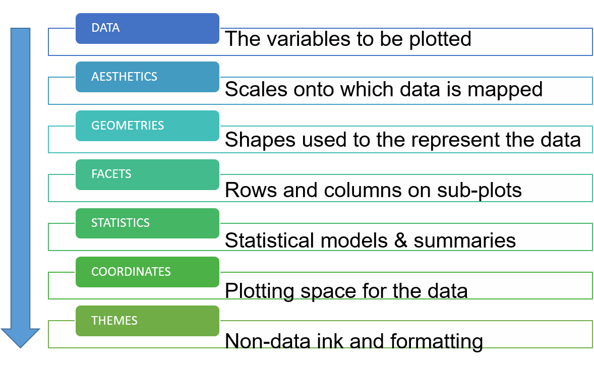
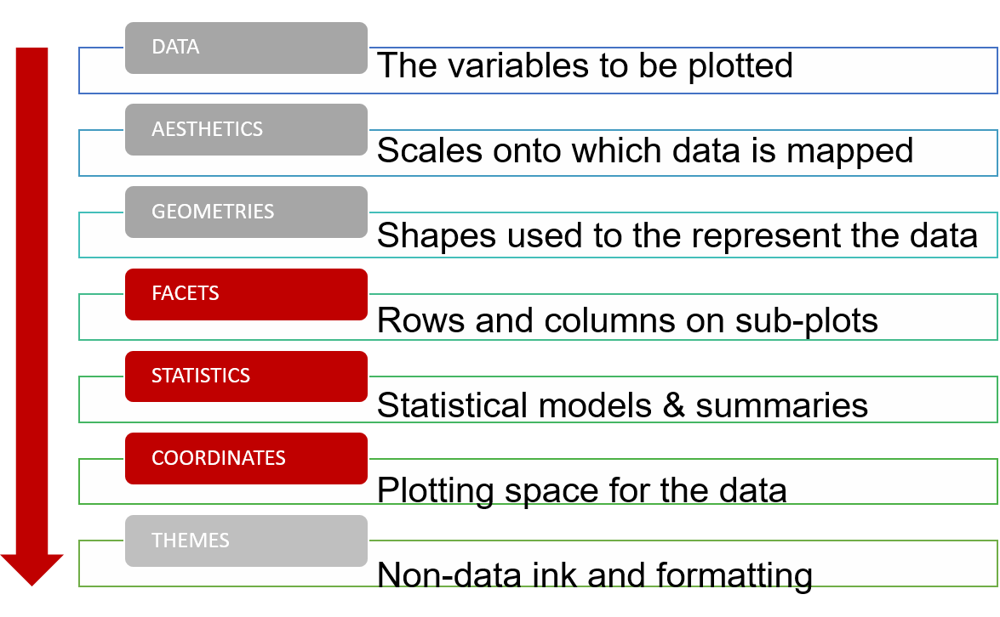

class: left, middle
####Tutorial 2

##Data Vizualization in R.
##ggplot2: statistics, coordinate system, facets. 
####Victoria Mironova 
####Associate Professor, Department of Plant Systems Physiology


---
```{r include = FALSE}
knitr::opts_chunk$set(message = FALSE, warning = FALSE, fig.retina = 3)
set.seed(100)
```

```{r libraries, message=FALSE, include=FALSE} 
library(xaringanExtra)
library(xaringan)
library(tidyverse)
library(ggplot2)
library(cowplot)
library(viridis)
library(RColorBrewer)
library(kableExtra)
use_xaringan_extra(c('panelset', 'editable', 'tile_view', 'scribble'))
```

.pull-left[
#Course structure

**Week 1-2:**</br>
Lecture 1. Principles of figure design.</br>
Quiz 1.

**Week 3-4:**</br>
Tutorial 1. ggplot2: plots and charts.</br>
Quiz 2.

**Week 5-6:**</br>
**Tutorial 2. ggplot2: statistics, coordinate system, facets.** </br>
Tutorial 3. ggplot2: themes and styles.</br>
**Practice 1.** </br>
Quiz 3.

**Week 7-8:**</br>
Practice 2. Project.</br>
Practice 3. Project.</br>
Practice 4. Project.</br>
Assignment.
]

--
.pull-right[

# Learning goals	

- Understand the basic principles behind effective data visualization	

- **Create data visualizations in R using ggplot2**

- Craft elegant visual presentations of data

]

---
#Grammar of graphics

.pull-left[
```{r, out.width='100%', fig.cap="Layers in grammar of graphics", echo = FALSE}

```
]
.pull-right[
There are two important principles behind *grammar of graphics*:

- Graphics are made of distinct layers of grammatical elements

- Plots are built with appropriate aesthetic mappings to make these plots meaningful

]
---
#Grammar of graphics

.pull-left[
```{r, out.width='100%', fig.cap="Layers in grammar of graphics", echo = FALSE}

```
]
.pull-right[

**Coordinate system:** What kind of a coordinate system should the visualization be based on — should it be cartesian or polar?

**Facets:** Do we need to create subplots based on specific data dimensions?

**Statistics:** Do we need to show some statistical measures in the visualization like measures of central tendency, spread, confidence intervals?

]
---
class: left, middle, inverse

#Plan of the tutorial

- Extended graphing template

- Coordinate system

- Faceting

- Statistics

- Save visualizations
---
#Data

We keep working with the data on:
Number of deaths in the population of the Netherlands by main underlying cause of death, by age and sex, 1996-2021.

```{r death table formatted, warning=FALSE, message = FALSE, echo = FALSE} 
Death_in_NL <- read_delim(file = "Data/Death_in_NL_formatted.csv", col_names = TRUE, delim = ",")
knitr::kable(slice_sample(Death_in_NL, n = 5), format = 'html')

```

- **ID**: Numeric, continuous;
- **Sex**: Categorical, unordered;
- **Age**: Categorical, ordered;
- **CausesOfDeath**: categorical, unordered;
- **Year**: Numeric, discreet;
- **Deaths**: Numeric, continuous.

---
#Updated graphing template

On the last tutorial you saw an incomplete template highlighted in yellow. Below is a complete one.

```{r not eval, warning=FALSE, eval = FALSE} 

ggplot(data = <DATA>)+ #<<
  <GEOM_FUNCTION>( #<<
    mapping = aes(<MAPPINGs>),#<<
    method = <STAT>,
    position = <POSITION>) +
  <STAT_FUNCTION>()+
  <COORDINATE_FUNCTION>()+
  <FACET_FUNCTION>()+
  <THEME>()
```
---
class: center, middle, inverse

#Coordinate systems
---
#Cartesian Coordinates
.pull-left[
When we plot a chart using ggplot2, Cartesian Coordinates is the default coordinate system.
``` {r cartesian coordinates, eval = FALSE}
Death_in_NL %>%
  filter(Age == "Total", CausesOfDeath == "Infections")%>%
  ggplot(mapping = aes(x = Year, y = Deaths, color = Sex))+
  geom_path()+
  geom_point(size = 2.5)+
  ggtitle("Number of deaths from infections")
```

]
.pull-right[
``` {r cartesian coordinates, eval = TRUE, fig.width = 8, fig.asp = 0.8, fig.align = "center", echo = FALSE}
```
]
---
#Cartesian coordinates: zooming in
.pull-left[
When we plot a chart using ggplot2, Cartesian Coordinates is the default coordinate system.
``` {r cartesian coordinates2, eval = FALSE}
Death_in_NL %>%
  filter(Age == "Total", CausesOfDeath == "Infections")%>%
  ggplot(aes(x = Year, y = Deaths, color = Sex))+
  geom_path()+
  geom_point(size = 2.5)+
  coord_cartesian(xlim = c(2013, 2021))+ #<<
  ggtitle("Number of deaths from infections")
```

But you can still set it specifying parameters, for example, to zoom in the plot display.
]
.pull-right[
``` {r cartesian coordinates2, eval = TRUE, fig.width = 8, fig.asp = 0.8, fig.align = "center", echo = FALSE}
```
]
---
#Flipped cartesian coordinates

It is convenient to flip the axes when the name of the groups on the x axis is long.

.pull-left[
``` {r flipped barplot, eval = FALSE}
Death_in_NL%>%
  filter(Year == 2020, Age == "Total")%>%
  ggplot(aes(x = CausesOfDeath, y = Deaths))+
  geom_col()+
  coord_flip()+ #<<
  ggtitle("Causes of Death in NL, 2020")
```

]
.pull-right[
``` {r flipped barplot, eval = TRUE, echo = FALSE, fig.width = 8, fig.asp = 0.8, fig.align = "center"}
```
]
---
#Change the order of the groups on the axis

You might also need to change the order of unordered categorical data on the axis.

.pull-left[
``` {r flipped barplot2, eval = FALSE}
Death_in_NL%>%
  filter(Year == 2020, Age == "Total")%>%
  ggplot(aes(x = reorder(CausesOfDeath, -Deaths), y = Deaths))+ #<<
  geom_col()+ 
  coord_flip()+
  ggtitle("Causes of Death in NL, 2020")
```

]
.pull-right[
``` {r flipped barplot2, eval = TRUE, echo = FALSE, fig.width = 8, fig.asp = 0.8, fig.align = "center"}
```
]
---
#Change an axis scale

.pull-left[
``` {r default barplot axes log, eval = FALSE,fig.width = 8, fig.asp = 0.8, fig.align = "center"}
Death_in_NL%>%
  filter(Year == 2020, Age == "Total")%>%
  ggplot(aes(x = reorder(CausesOfDeath, -Deaths), y = Deaths))+
  geom_col()+ 
  coord_flip()+
  scale_y_log10()+#<<
  ggtitle("Causes of Death in NL, 2020")

```
You can learn more about specifying the axes [here](https://ggplot2-book.org/scale-position.html)
]
.pull-right[
``` {r default barplot axes log, eval = TRUE, echo = FALSE, fig.width = 8, fig.asp = 0.8, fig.align = "center"}
```
]

---
#Polar coordinates
.pull-left[
``` {r polar coordinates, eval = FALSE}
Death_in_NL %>%
  filter(Age == "Total", Sex == "Male", CausesOfDeath == "Infections")%>%
  ggplot(aes(x = Year, y = Deaths))+
  geom_col()+
  coord_polar(start = pi/2)+ #<<
  ggtitle("Number of deaths from infections, men")

```
]
.pull-right[
``` {r polar coordinates, eval = TRUE,  echo = FALSE, fig.width = 8, fig.asp = 0.8, fig.align = "center"}
```
]
---
#Polar coordinate system: pie chart

We use polar coordinate system to build pie charts
.pull-left[
``` {r polar coordinates2, eval = FALSE}
Death_in_NL %>%
  filter(Age == "Total", CausesOfDeath == "Infections")%>%
  ggplot(aes(x = "", y = Deaths, fill = Sex))+
  geom_col()+
  coord_polar("y", start = 0)+ #<<
  ggtitle("Deaths from infections")+
  theme_void() # remove background, grid, numeric labels

```
[Here](https://r-graph-gallery.com/piechart-ggplot2.html) you can learn how to add the labels on the pie chart.
]
.pull-right[
``` {r polar coordinates2, eval = TRUE,  echo = FALSE, fig.width = 8, fig.asp = 0.8, fig.align = "center"}
```
]

---
class: center, middle, inverse
#Facetted graphs
---
#Vizualizing data slices, line plot

.panelset[
.panel[.panel-name[Code]
``` {r facet, eval = FALSE}
nb.cols <- 18
mycolors <- colorRampPalette(brewer.pal(8, "Set1"))(nb.cols)

Death_in_NL %>%
  filter(Age == "Total")%>%
  ggplot(aes(x = Year, y = Deaths, color = CausesOfDeath))+
  geom_path(linewidth = 1)+
  scale_colour_manual(values = mycolors)+
  ggtitle("Total number of deaths from different causes")+
  facet_wrap( ~ Sex)#<<

```
]
.panel[.panel-name[Output]
```{r facet, eval = TRUE, echo = FALSE, fig.width = 14, fig.height = 6} 
```
]
]
---
#Vizualizing data slices, heatmap

.panelset[
.panel[.panel-name[Code]
``` {r heatmap facet, eval = FALSE}
Death_in_NL %>% 
  filter(CausesOfDeath == "Infections", Age != "Total") %>% 
  ggplot(mapping = aes(x = Year, y = Age, fill = Deaths))+
  geom_tile()+
  scale_fill_viridis(discrete = FALSE)+
  ggtitle("Number of deaths from infections")+
  facet_wrap(~Sex)

```
]
.panel[.panel-name[Output]
```{r heatmap facet, eval = TRUE, echo = FALSE, fig.width = 14, fig.height = 6} 
```
]
]
---
#One can generate many facets of data

.panelset[
.panel[.panel-name[Code]
``` {r heatmap facet2, eval = FALSE}
Death_in_NL %>% 
  filter(Sex == "Male", Age != "Total") %>% 
  ggplot(mapping = aes(x = Year, y = Age, fill = Deaths))+
  geom_tile()+
  scale_fill_viridis(discrete = FALSE)+
  facet_wrap(~CausesOfDeath)
```
]
.panel[.panel-name[Output]
```{r heatmap facet2, eval = TRUE, echo = FALSE, fig.width = 14, fig.height = 7} 
```
]
]
---
#Arrange multiple plots in a grid

You can use other packages to organize individual plots altogether. E.g `plot_grid` from `cowplot` package.

.panelset[
.panel[.panel-name[Code]
``` {r collective geom, eval = FALSE}
smoothp <- Death_in_NL %>% 
  filter(CausesOfDeath == "Infections", Age == "Total") %>% 
  ggplot(mapping = aes(x = Year, y = Deaths, color = Sex))+
  geom_smooth()+
  ggtitle("Smoothed conditional means")

boxp <- Death_in_NL %>% 
  filter(Age == "Total") %>% 
  ggplot(mapping = aes(x = Sex, y = Deaths, fill = Sex))+
  geom_boxplot()+
  ggtitle("Boxplot")
  
denp <- Death_in_NL %>% 
  filter(Age == "Total") %>% 
  ggplot(aes(x = Deaths, fill = Sex))+
  geom_density(alpha = 0.5)+
  ggtitle("Smoothed density estimate")

plot_grid(smoothp, denp, boxp, ncol = 3, label_size = 12)

```
]
.panel[.panel-name[Output]
```{r collective geom, eval = TRUE, echo = FALSE, fig.width = 14, fig.height = 5} 
```
]
]
---

class: middle, inverse

#Statistics layer

Two categories of functions:

- called from within a geom

- called independently

--

All the statistics functions called independently starts with *stat_*

---
#Some geoms have built-in statistical methods

.pull-left[
```{r line chart, fig.height= 5} 
Death_in_NL%>% 
  filter(CausesOfDeath == "Neoplasms", Sex == "Male", Age != "Total")%>%
  ggplot(aes(x = Year, y = Deaths))+
    geom_path()

```
]

.pull-right[
```{r smooth line chart, message = FALSE, fig.height= 5} 
Death_in_NL%>% 
  filter(CausesOfDeath == "Neoplasms", Sex == "Male", Age != "Total")%>%
  ggplot(aes(x = Year, y = Deaths))+
    geom_smooth()
```
]

---
#Adjusting statistical methods in geom

.pull-left[
```{r smooth line stat1, message = FALSE, fig.height= 5} 
Death_in_NL%>% 
  filter(CausesOfDeath == "Neoplasms", Sex == "Male", Age != "Total")%>%
  ggplot(aes(x = Year, y = Deaths))+
    geom_smooth(method = "lm",
                formula = y ~ x)
```
]
.pull-right[
```{r smooth line stat2, message = FALSE, fig.height= 5} 
Death_in_NL%>% 
  filter(CausesOfDeath == "Neoplasms", Sex == "Male", Age != "Total")%>%
  ggplot(aes(x = Year, y = Deaths))+
    geom_path()+
    geom_smooth(method = "lm", se = FALSE)
```
]
---
#Showing statistical estimates on a plot

Lets draw a bar plot with error bars using `geom_errorbar()` function. Lets use the annual data as independent observations.

**Note:** the lower and upper limits of your error bars must be computed before building the chart, and available in a column of the input data.

.pull-left[
```{r bar plot summarize, message = FALSE} 
data_stat <- Death_in_NL%>%
  filter(Sex == "Male", Age == "Total")%>%
    group_by(CausesOfDeath)%>%
    summarize(mean = mean(Deaths),
            se = sd(Deaths)/sqrt(n()),
            max = mean + se,
            min = mean - se,
            N = n())
```
]
.pull-right[
```{r bar plot summarize table, message = FALSE, echo = FALSE}
knitr::kable(data_stat, format = 'html')%>%
  kable_styling(font_size = 9)
```
]
---
#Bar Plot with error bars 
.pull-left[
```{r bar plot SD, eval = FALSE, message = FALSE} 
data_stat%>%
  ggplot(aes(x = reorder(CausesOfDeath, -mean), y = mean, ymin = min, ymax = max))+
  geom_col()+ 
  coord_flip()+
  geom_errorbar(width =0.5)+
  ggtitle("Causes of Death in NL, male")
```
]
.pull-right[
```{r bar plot SD, eval = TRUE, echo = FALSE, message = FALSE, fig.height= 5} 
```
]
---
#Use of statistical functions in ggplot2
.pull-left[
```{r bar plot SD2, eval = FALSE, message = FALSE, warning = FALSE} 
Death_in_NL%>%
  filter(Age == "Total")%>%
  ggplot(aes(x = reorder(CausesOfDeath, -Deaths), y = Deaths))+
  stat_summary(size = 0.3)+ #<<
  coord_flip()+
  ggtitle("Causes of Death in NL")
```
]
.pull-right[
```{r bar plot SD2, eval = TRUE, message = FALSE, warning = FALSE, echo = FALSE} 
```
]
---
#Use of *stat_summary* in ggplot2
.pull-left[
```{r bar plot SD3, eval = FALSE, message = FALSE, warning = FALSE} 
Death_in_NL%>%
  filter(Age == "Total")%>%
  ggplot(aes(x = reorder(CausesOfDeath, -Deaths), y = Deaths))+
  stat_summary(fun.data = "mean_se", geom = "bar")+ #<<
  stat_summary(fun.data = "mean_se", geom = "errorbar", width = 0.5)+ #<<
  coord_flip()+
  ggtitle("Causes of Death in NL")
```
]
.pull-right[
```{r bar plot SD3, eval = TRUE, message = FALSE, warning = FALSE, echo = FALSE} 
```
]

---
#Saving the plot
You can use `ggsave()` to save the vizualization in the format and resolution you wish.
```{r ggsave, eval = FALSE}
?ggsave

ggsave(
  filename,
  plot = last_plot(),
  device = NULL,
  path = NULL,
  scale = 1,
  width = NA,
  height = NA,
  units = c("in", "cm", "mm", "px"),
  dpi = 300,
  limitsize = TRUE,
  bg = NULL,
  ...
)

ggsave(filename= "figs/BarPlotSD.png", device = png, width = 10, height = 10, units = "cm")
```
---
#Your turn

Using the `Death_in_NL` dataset, build the following two visualizations:

1) What is the age profile of the number of deaths from external causes (not a disease) in NL? Is there any difference between men and women? 

2) How has the number of perinatal deaths in the Netherlands changed over time? 

You will need this information to complete the quiz in the brightspace (to be done after Tutorial 3).


