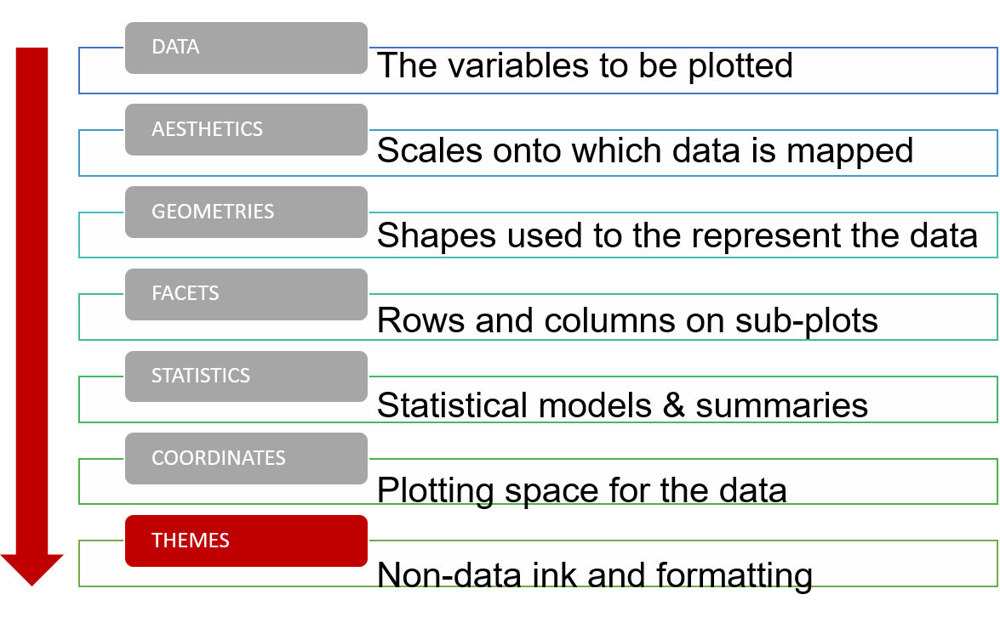

class: left, middle
####Tutorial 3

##Data Vizualization in R.
##ggplot2: themes and styles. 
####Victoria Mironova 
####Associate Professor, Department of Plant Systems Physiology


---
```{r include = FALSE}
knitr::opts_chunk$set(message = FALSE, warning = FALSE, fig.retina = 3)
set.seed(100)
```


```{r libraries, message=FALSE, include=FALSE} 
library(xaringanExtra)
library(xaringan)
library(tidyverse)
library(ggplot2)
library(cowplot)
library(viridis)
library(RColorBrewer)
library(kableExtra)
use_xaringan_extra(c('panelset', 'editable', 'tile_view', 'scribble'))
```

```{r death table formatted, warning=FALSE, message = FALSE, echo = FALSE} 
Death_in_NL <- read_delim(file = "Data/Death_in_NL_formatted.csv", col_names = TRUE, delim = ",")
```

.pull-left[
#Course structure

**Week 5:**</br>
Lecture 1. Principles of figure design.</br>
Quiz 1.

**Week 6:**</br>
Tutorial 1. ggplot2: plots and charts.</br>
Quiz 2.

**Week 7:**</br>
Tutorial 2. ggplot2: statistics, coordinate system, facets. </br>
**Tutorial 3. ggplot2: themes and styles.**</br>
**Practice 1.** </br>
Quiz 3.

**Week 8:**</br>
Practice 2. Project.</br>
Practice 3. Project.</br>
Practice 4. Project.</br>
Assignment.
]

--
.pull-right[

# Learning goals	

- Understand the basic principles behind effective data visualization	

- Create data visualizations in R using ggplot2

- **Craft elegant visual presentations of data**

]
---
#Grammar of graphics

.pull-left[
```{r, out.width='100%', fig.cap="Layers in grammar of graphics", echo = FALSE}

```
]
.pull-right[

The **Themes Layer** refers to all non-data ink. 

- You can change the labels of x or y axis, 

- add a plot title, 

- modify a legend title and position, 

- add text anywhere on the plot, 

- change the background color, axis lines, plot lines, 

- etc. 

]
---
class: middle, inverse

# Plan of the tutorial

- Themes principles

- Build-in themes

- Data annotation

- Customized design 1

- Customized design 2

---
# ?Theme()

There are three types of elements within the themes Layer: text, line, and rectangle.

Any text element can be modified with `element_text()`

Any line element can be modified with `element_line()`

Any rect element can be modified with `element_rect()`


One can also use `element_blank()` function to drop the element.

---
#Build-in themes

For the most part you can probably avoid the theme() function by using built-in themes, unless there is a specific element you want to modify.

.panelset[
.panel[.panel-name[Code]
```{r themes, eval = FALSE}
p <- Death_in_NL %>%
  filter(Age == "Total", CausesOfDeath == "Infections")%>%
  ggplot(mapping = aes(x = Year, y = Deaths, linetype = Sex))+
  geom_path(show.legend = FALSE)

p1 <- p +  theme_classic()
p2 <- p +  theme_bw()
p3 <- p +  theme_light()
p4 <- p + theme_void()
p5 <- p + theme_cowplot()
p6 <- p + theme_dark()

plot_grid(p1, p2, p3, p4, p5, p6, ncol = 3, labels = c("theme_classic()", "theme_bw()", "theme_light()", "theme_void()", "theme_cowplot()", "theme_dark()"))
```
]
.panel[.panel-name[Output]
```{r themes, eval = TRUE, echo = FALSE, fig.width = 14, fig.height = 5}
```
]
]
---
#Customised theme: change styles of axes texts and lines

.pull-left[
```{r theme axes, eval = FALSE}
p <- Death_in_NL %>%
  filter(Age == "Total", CausesOfDeath == "Infections")%>%
  ggplot(mapping = aes(x = Year, y = Deaths, linetype = Sex))+
  geom_path(show.legend = FALSE)

p1 <- p + theme(axis.line = element_line(linewidth = 3, colour = "grey80"))
p2 <- p + theme(axis.text = element_text(colour = "blue"))
p3 <- p + theme(axis.ticks = element_line(linewidth = 2))

plot_grid(p, p1, p2, p3, ncol = 1, labels = c("default", "axis width", "axis text", "axis ticks"),
          label_x = 0.5, label_y = 1, hjust = 0, vjust = 1)
```
]
.pull-right[
```{r ref.label= "theme axes", eval = TRUE, echo = FALSE, fig.height= 6}
```
]
---
#Customised theme: axes and legend text formatting
.pull-left[
``` {r themes example, fig.width = 8, fig.asp = 0.6, fig.align = "center", warning = FALSE, eval = FALSE}
p <- Death_in_NL %>%
  filter(Age == "Total", Sex == "Male")%>%
  ggplot(aes(x = Year, y = Deaths, color = CausesOfDeath), linewidth = 2)+
  geom_path()+
  scale_color_discrete()

p1 <- p + theme_classic()+
  ggtitle("Total number of deaths from different causes, male")+
  labs(x = NULL, y = NULL)+
  theme(legend.title = element_blank(),
        axis.text = element_text(size = 11),
        legend.text = element_text(size = 11))
p
p1
```
]
.pull-right[
``` {r ref.label = "themes example", fig.height = 3.8, echo = FALSE}
```
]

---
#labs: annotate the plot

Good labels are critical for making your plots accessible to a wider audience. Always ensure the axis and legend labels display the full variable name. Use the plot title and subtitle to explain the main findings.
.pull-left[
```{r theme labs, eval = FALSE}
Death_in_NL %>%
  filter(Age == "Total", CausesOfDeath == "Infections")%>%
  ggplot(mapping = aes(x = Year, y = Deaths, linetype = Sex))+
  geom_path(show.legend = FALSE)+
  labs(title = "It is a title", 
       subtitle = "with an additional description",
       caption = "Caption. It's common to use the caption to provide information about the data source.",
       x = "New x label",
       y = "New y Label")+
  theme(text = element_text(size = 15))
```
]
.pull-right[
```{r ref.label= "theme labs", eval = TRUE, echo = FALSE, fig.height= 6}
```
]
---
#Scales formatting and transformations

`scale_` family of functions affect how a single observation raw data is 'interpreted' before going on the graph. There are two types of scales: `continuous` and  `discrete`. `scale_` functions are used to set colors, limits, and transformations.


.pull-left[
```{r theme scales, eval = FALSE}
p <- Death_in_NL %>%
  filter(Age == "Total", CausesOfDeath == "Infections")%>%
  ggplot(mapping = aes(x = Year, y = Deaths, color = Sex))+
  geom_path(show.legend = FALSE)

p1 <- p + scale_color_brewer(palette = 'Set1')
p2 <- p + scale_color_manual(values = c("yellow", "dark gray"))
p3 <- p + scale_y_continuous(position = "right", limits = c(0, 2000), name = NULL)
          

plot_grid(p, p1, p2, p3, ncol = 1, labels = c("default", "Color Brewer", "Scale Manual", "Scale y continuous"),
          label_x = 0.5, label_y = 1, hjust = 0, vjust = 1)
```
]
.pull-right[
```{r ref.label= "theme scales", eval = TRUE, echo = FALSE, fig.height= 6}
```
]

---
class: inverse, middle

#Customised bar plot: example
---
#Lets customize the bar plot we built on Tutorial 2

.pull-left[
```{r bar plot SD3, eval = FALSE, message = FALSE, warning = FALSE} 
Death_in_NL%>%
  filter(Age == "Total", Sex == "Male")%>%
  ggplot(aes(x = reorder(CausesOfDeath, -Deaths), y = Deaths))+
  stat_summary(fun.data = "mean_se", geom = "bar")+
  coord_flip()+
  ggtitle("Causes of Death in NL")
```

What I don't like:

1. the y axis title is non-sense
1. the x axis title is unclear
1. the text size on the y axis is too small
1. the gray background is annoying
1. the columns color is not appealing

Lets address those issues!

]
.pull-right[
```{r bar plot SD3, eval = TRUE, message = FALSE, warning = FALSE, echo = FALSE} 
```
]
---
#Customised bar plot

.pull-left[
1. the y axis title is non-sense
1. the x axis title is unclear
1. the text size on the y axis is too small
1. the gray background is annoying
1. the columns color is not appealing

```{r customised bar plot, eval = FALSE}
Death_in_NL%>%
  filter(Age == "Total", Sex == "Male")%>%
  ggplot(aes(x = reorder(CausesOfDeath, -Deaths), y = Deaths))+
  stat_summary(fun.data = "mean_se", geom = "bar")+
  coord_flip()+
  labs(y = NULL, x = NULL)+#<<
  ggtitle("Number of deceased men per year in NL (1996 - 2021)")#<<
```
]
.pull-right[
```{r customised bar plot, eval = TRUE, echo = FALSE}
```
]
---
#Customised bar plot

.pull-left[
1. ~~the y axis title is non-sense~~
1. ~~the x axis title is unclear~~
1. the text size on the y axis is too small
1. the gray background is annoying
1. the columns color is not appealing

```{r customised bar plot2, eval = FALSE}
Death_in_NL%>%
  filter(Age == "Total", Sex == "Male")%>%
  ggplot(aes(x = reorder(CausesOfDeath, -Deaths), y = Deaths))+
  stat_summary(fun.data = "mean_se", geom = "bar")+
  coord_flip()+
  labs(y = NULL, x = NULL)+
  theme_classic()+#<<
  theme(axis.text = element_text(size = 12),#<<
        title = element_text(size = 13))+#<<
  ggtitle("Number of deceased men per year in NL (1996 - 2021)")#<<
```
]
.pull-right[
```{r customised bar plot2, eval = TRUE, echo = FALSE}
```
]
---
#Customised bar plot

.pull-left[
1. ~~the y axis title is non-sense~~
1. ~~the x axis title is unclear~~
1. ~~the text size on the y axis is too small~~
1. ~~the gray background is annoying~~
1. the columns color is not appealing

```{r customised bar plot3, eval = FALSE}
Death_in_NL%>%
  filter(Age == "Total", Sex == "Male")%>%
  ggplot(aes(x = reorder(CausesOfDeath, -Deaths), y = Deaths))+
  stat_summary(fun.data = "mean_se", geom = "bar", 
               fill = "#99d8c9")+#<<
  coord_flip()+
  labs(y = NULL, x = NULL)+
  theme_classic()+
  theme(axis.text = element_text(size = 12),
        title = element_text(size = 13))+
  ggtitle("Number of deceased men per year in NL (1996 - 2021)")
```
You can pick the color [here](https://colorbrewer2.org/), or [here](https://fffuel.co/cccolor/)].
.pull-right[
```{r customised bar plot3, eval = TRUE, echo = FALSE}
```
]
---
#Customised bar plot: add annotation

One can add additional elements and annotations
.pull-left[
```{r bar annotation, eval = FALSE}
Death_in_NL%>%
  filter(Age == "Total", Sex == "Male")%>%
  ggplot(aes(x = reorder(CausesOfDeath, -Deaths), y = Deaths, fill = Sex))+
  stat_summary(fun.data = "mean_se", geom = "bar", fill = "#99d8c9")+
  geom_hline(yintercept=3000, linetype="dotted")+#<<
  annotate(geom="text", x=15, y=5800, label="Upper threshold", size = 4.5)+#<<
  coord_flip()+
  labs(y = NULL, x = NULL)+
  theme_classic()+
  theme(axis.text = element_text(size = 12),
        title = element_text(size = 13))+
  ggtitle("Number of deceased men per year in NL (1996 - 2021)")
```
]
.pull-right[
```{r bar annotation, eval = TRUE, echo = FALSE, fig.height = 6}
```
]
---
#Customised bar plot: facets

.pull-left[
```{r facet, eval = FALSE}
Death_in_NL%>%
  filter(Age == "Total")%>%
  ggplot(aes(x = reorder(CausesOfDeath, -Deaths), y = Deaths, fill = Sex))+#<<
  stat_summary(fun.data = "mean_se", geom = "bar", show.legend = FALSE)+#<<
  coord_flip()+
  labs(y = NULL, x = NULL)+
  scale_fill_manual(values = c("#fed99b", "#99d8c9"))+#<<
  theme_classic()+
  theme(axis.text = element_text(size = 12),
        title = element_text(size = 14))+
  ggtitle("Number of deceased per year in NL (1996 - 2021)")+
  facet_wrap(~Sex)#<<
```
]
.pull-right[
```{r facet, eval = TRUE, echo = FALSE}
```
]
---

#Customised bar plot: facets

.pull-left[
```{r facet2, eval = FALSE}
Death_in_NL%>%
  filter(Age == "Total")%>%
  ggplot(aes(x = reorder(CausesOfDeath, -Deaths), y = Deaths, fill = Sex))+
  stat_summary(fun.data = "mean_se", geom = "bar", show.legend = FALSE)+
  coord_flip()+
  labs(y = NULL, x = NULL)+
  scale_fill_manual(values = c("#fed99b", "#99d8c9"))+
  theme_classic()+
  theme(axis.text = element_text(size = 12),
        title = element_text(size = 14),
        strip.background = element_blank(), #<<
        strip.text = element_text(size = 14))+#<<
  ggtitle("Number of deceased per year in NL (1996 - 2021)")+
  facet_wrap(~Sex)
```
]
.pull-right[
```{r facet2, eval = TRUE, echo = FALSE}
```
]
---
class: inverse, middle
#Customised strip chart

---
#Vizualizations to explore the data

Lets zoom in to the top2 causes of death in NL and explore if the gender-related differences are significant or not

.pull-left[
```{r strip, eval = FALSE}
Death_in_NL%>%
  filter(Age == "Total", CausesOfDeath == c("Neoplasms", "CirculatorySystem"))%>%
  ggplot(aes(x = Sex, y = Deaths, fill = Sex))+
  stat_summary(fun.data = "mean_se", geom = "bar", show.legend = FALSE)+
  scale_fill_manual(values = c("#fed99b", "#99d8c9"))+
  theme_classic()+
  theme(axis.text = element_text(size = 12),
        title = element_text(size = 14),
        strip.background = element_blank(), 
        strip.text = element_text(size = 14))+
  ggtitle("Number of deceased per year in NL (1996 - 2021)")+
  facet_wrap(~CausesOfDeath)
```
]
.pull-right[
```{r strip, eval = TRUE, echo = FALSE}
```
]
---
#Showing individual observations on the plot
Lets plot individual observations instead of the bar plot using `geom_jitter`.
This will requires some adjustments of the code.
.pull-left[
```{r strip1, eval = FALSE}
Death_in_NL%>%
  filter(Age == "Total", CausesOfDeath == c("Neoplasms", "CirculatorySystem"))%>%
  ggplot(aes(x = Sex, y = Deaths, fill = Sex))+
  geom_jitter(show.legend = FALSE, alpha = 0.7, shape = 21, size = 2, width = 0.1)+ #<<
  scale_color_manual(values = c("#ef8a62", "#67a9cf"))+ #<<
  theme_classic()+
  theme(axis.text = element_text(size = 12),
        title = element_text(size = 14),
        strip.background = element_blank(), 
        strip.text = element_text(size = 14))+
  ggtitle("Number of deceased per year in NL (1996 - 2021)")+
  facet_wrap(~CausesOfDeath)
```
Are the differences significant?
]
.pull-right[
```{r strip1, eval = TRUE, echo = FALSE}
```
]
---
#Showing individual observations on the plot
Would be better having some statistical estimates on the top of the individual observations.

.pull-left[
```{r strip2, eval = FALSE}
Death_in_NL%>%
  filter(Age == "Total", CausesOfDeath == c("Neoplasms", "CirculatorySystem"))%>%
  ggplot(aes(x = Sex, y = Deaths, fill = Sex))+
  geom_jitter(show.legend = FALSE, alpha = 0.7, shape = 21, size = 2, width = 0.1)+ 
  stat_summary(fun.data = "mean_se", show.legend = FALSE)+ #<<
  scale_color_manual(values = c("#ef8a62", "#67a9cf"))+ 
  theme_classic()+
  labs(x = NULL, y = "Number of deceased per year in NL (1996 - 2021)")+#<<
  theme(axis.text = element_text(size = 12),
        title = element_text(size = 14),
        strip.background = element_blank(), 
        strip.text = element_text(size = 14),
        strip.placement = "outside")+#<<
  facet_wrap(~CausesOfDeath, strip.position = "bottom")#<<
```
Are the differences significant?
```{r significance, eval = TRUE, echo = FALSE}
test2 <-Death_in_NL%>%
  filter(Age == "Total", CausesOfDeath == c("CirculatorySystem"))
kt2 <- kruskal.test(Deaths ~ Sex, test2)

test <-Death_in_NL%>%
  filter(Age == "Total", CausesOfDeath == c("Neoplasms"))
kt<-  kruskal.test(Deaths ~ Sex, test)

pt2<- pairwise.wilcox.test(test2$Deaths, test2$Sex, p.adjust.method = "BH")

pt1<- pairwise.wilcox.test(test$Deaths, test$Sex, p.adjust.method = "BH")
pt1$p.value
```
]
.pull-right[
```{r strip2, eval = TRUE, echo = FALSE, fig.height = 5}
```
]
---
#Showing significance levels
.pull-left[
```{r strip final, eval = FALSE}
Death_in_NL%>%
  filter(Age == "Total", CausesOfDeath == c("Neoplasms", "CirculatorySystem"))%>%
  ggplot(aes(x = Sex, y = Deaths, fill = Sex))+
  geom_jitter(show.legend = FALSE, alpha = 0.7, shape = 21, size = 2, width = 0.1)+ 
  stat_summary(fun.data = "mean_se", show.legend = FALSE)+
  scale_color_manual(values = c("#ef8a62", "#67a9cf"))+ 
  theme_classic()+
  labs(x = NULL, y = "Number of deceased per year in NL (1996 - 2021)")+
  theme(axis.text = element_text(size = 12),
        title = element_text(size = 14),
        strip.background = element_blank(), 
        strip.text = element_text(size = 14),
        strip.placement = "outside")+
  facet_wrap(~CausesOfDeath, strip.position = "bottom")+
  geom_line(data = tibble(x = c(1,2), y= c(26000, 26000)), #<<
            aes(x=x, y = y), inherit.aes = FALSE)+#<<
  geom_text(data = tibble(x = c(1.5), y= c(26100)), #<<
            aes(x=x, y = y, label = "**"), inherit.aes = FALSE)#<<
```
]
.pull-right[
```{r strip final, eval = TRUE, echo = FALSE, fig.height = 5}
```
]
---
#Vizualizing statistical data using ggpubr package
The [`ggpubr`](https://rpkgs.datanovia.com/ggpubr/) package provides some easy-to-use functions for creating and customizing ‘ggplot2’- based publication ready plots.

.pull-left[
```{r strip3, eval = FALSE}
library(ggpubr)

Death_in_NL%>%
  filter(Age == "Total", CausesOfDeath == c("Neoplasms", "CirculatorySystem"))%>%
  ggboxplot(x = "Sex", y = "Deaths",
                color = "Sex", palette =c("#00AFBB", "#E7B800"),
                add = "jitter", shape = "Sex")+
  facet_wrap(~CausesOfDeath)+
  stat_compare_means(label = "p.format", label.x = 1.5)+
  labs(x = NULL, y = "Number of deceased men per year in NL (1996 - 2021)")+
  theme(axis.text = element_text(size = 12),
        title = element_text(size = 14),
        strip.background = element_blank(), 
        strip.text = element_text(size = 14))+
  rremove("legend")
```
]
.pull-right[
```{r strip3, eval = TRUE, echo = FALSE, fig.height= 6}
```
]
---
#Your turn

Part1.

Using Death_in_NL dataset build the following two vizualizations:
- What is an age profile of the number of deaths from external causes (not a disease) in NL? Is there any differences between
man and women?
- How the number of perinatal deaths in NL changed over time?

You will need these data to answer the quiz in the brightspace.</br>


Part 2.

- Adjust the style and design of the plot making it visually appealing.

You will need these skills to finalize your project next week.</br>
